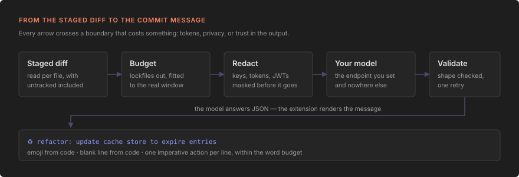

# Técnico

Como a extensão é construída e **por quê** cada decisão é o que é. Toda restrição abaixo foi
verificada na fonte (código da VS Code, doc do Ollama, medição local) — nenhuma é preferência.



## Restrições que definem o desenho

### 1. O ícone não pode ficar dentro da caixa de commit

`scm/inputBox` — o ponto de menu que renderiza o *sparkle* dentro do input de commit — é **API
proposed**. Em `src/vs/workbench/services/actions/common/menusExtensionPoint.ts` ele aparece como
`proposed: 'contribSourceControlInputBoxMenu'`, e a contribuição é descartada em build stable:

```ts
if (menu.proposed && !isProposedApiEnabled(extension.description, menu.proposed)) {
    collector.error(/* … */); continue;   // contribuição DERRUBADA
}
```

A issue microsoft/vscode#195474 está aberta desde 2023-10-12, milestone Backlog. Portanto: o botão
vive em **`scm/title`** (`group: "navigation"`, `when: "scmProvider == git"`), mais keybinding e
`registerPostCommitCommandsProvider`.

Consequência direta: o *action runner* que cria o `CancellationTokenSource` e troca o botão pelo
stop existe só para `scm/inputBox`. **Cancelamento é responsabilidade nossa.**

### 2. O argumento do comando não é um `Repository`

Vindo de `scm/title`, o core envia um `vscode.SourceControl` — e `undefined` quando há mais de um
repositório visível:

```ts
override getActionsContext(): unknown {
    return this.scmViewService.visibleRepositories.length === 1
        ? this.scmViewService.visibleRepositories[0].provider : undefined;
}
```

Atravessando o RPC, o objeto expõe o getter `rootUri` **e** a propriedade `_rootUri`. A resolução
correta é uma cascata explícita, nunca `repositories[0]`.

### 3. `extensionKind` não é declarado

`deduceExtensionKind()` já resolve para `["workspace"]` quando existe `main` e não existe
`browser`. É o lado certo: onde estão o repositório, o binário `git` e a API `vscode.git`. Uma
extensão `["ui"]` não conseguiria nem chamar `getExtension('vscode.git')` — APIs exportadas não
atravessam a fronteira UI↔workspace.

### 4. O extension host reescreve o seu `fetch`

`proxyResolver.ts` troca `globalThis.fetch`, `http`, `https`, `net`, `tls` e `undici`.
Defaults relevantes (`src/vs/platform/request/common/request.ts`): `http.proxySupport` =
`"override"`, `http.fetchAdditionalSupport` = `true`. Sob WSL, `http.useLocalProxyConfiguration`
faz o host Linux perguntar ao **Windows** como alcançar o destino.

O bypass embutido do `@vscode/proxy-agent` cobre **apenas** loopback:

```ts
if (hostname === 'localhost' || hostname === '127.0.0.1' || hostname === '::1' /* … */) {
    callback('DIRECT', 'localhost'); return;
}
```

E `shouldBypassProxy` casa por **sufixo** — `192.168.15.0/24` e `192.168.*` não funcionam.
Como o patch reconstrói o dispatcher (`new undici.Agent({ allowH2, connect: { ca } })`),
`rejectUnauthorized: false` é descartado: uma opção de "ignorar TLS" seria mentira.

### 5. Ollama nativo, não o shim OpenAI

O `/v1/chat/completions` do Ollama não expõe `options` — logo **não dá para ajustar `num_ctx`**,
que é justamente o que um prompt do tamanho de um diff precisa. Por isso o adapter Ollama é
separado do adapter OpenAI-compatible, e não uma configuração dele.

## Medições próprias

Feitas em 13/08/2026 contra `qwen2.5-coder:7b` e `llama3.1:8b`
([#1](https://github.com/solvelab/ai-commit-messages/issues/1)):

**Janela de contexto** existe em `/api/show`, sob uma chave cujo prefixo é a arquitetura:

```ts
const ctx = Object.entries(show.model_info ?? {})
  .find(([k]) => k.endsWith('.context_length'))?.[1] as number | undefined
```

| modelo | chave | contexto | capabilities |
|---|---|---|---|
| `qwen2.5-coder:7b` | `qwen2.context_length` | 32.768 | completion, tools, insert |
| `qwen3:8b` | `qwen3.context_length` | 40.960 | completion, tools, **thinking** |
| `llama3.1:8b` | `llama.context_length` | 131.072 | completion, tools |
| `gemma4:e2b` | `gemma4.context_length` | 131.072 | …, **thinking** |

`capabilities` conter `"thinking"` é a forma confiável de detectar modelo de raciocínio — melhor
que a lista de nomes hardcoded que outras ferramentas mantêm, porque não envelhece.

**Chars por token em diff**, contados pelo tokenizer do próprio modelo (`prompt_eval_count` com
`raw: true`), sobre 5 commits reais deste workspace: **média 3,25 · pior caso 2,66**. O número de
4 chars/token da OpenAI erra por ~35% em diff. O orçamento usa **2,6** como divisor conservador.

## Estrutura

Regra de costura: **nada que importa `vscode` faz lógica; nada que faz lógica importa `vscode`.**
É o que permite testar prompt, orçamento e sanitização no Vitest, sem subir Electron.

```
src/
  extension.ts      activate(): comandos, barra de status, migrações, disposables
  config.ts         leitura da configuração; settings.ts valida e normaliza
  configScope.ts    onde gravar uma setting e quem está sombreando o valor
  commands/         generate, configure, selectModel, setEndpoint, secrets, diagnose, migrate
  ui/               painel de configuração (webview) e a regra pura de quais campos ele mostra
  providers/        adaptador Ollama, adaptador OpenAI-compatible, catálogo de backends, auth
  prompt/           template, schema, render determinístico, sanitização, validação, pipeline
  budget/           exclusão de gerados e orçamento por arquivo
  git/              API do git, resolução de repositório, coleta de diff
  models/           catálogo embutido, cache e origem da lista
  redact.ts         mascara segredos antes de o diff sair da máquina
  net.ts            AbortSignal, ponte de CancellationToken, causa real do erro
  types/git.d.ts    cópia de extensions/git/src/api/git.d.ts (não existe pacote npm)
  test/integration/ suíte que sobe uma VS Code de verdade
```

## Build e testes

| comando | o que faz | por quê |
|---|---|---|
| `npm run check-types` | `tsc --noEmit` | esbuild **não** faz type check — é gate separado |
| `npm run lint` | ESLint 9 flat | |
| `npm run test:unit` | Vitest, `src/**/*.test.ts` menos `src/test/**` | módulos puros, milissegundos |
| `npm test` | `vscode-test` sobre `out/test/**/*.test.js` | Mocha dentro de uma VS Code real |
| `npm run package` | esbuild `--production` | bundle CJS único em `dist/extension.js` |

`external: ['vscode']` é obrigatório: o módulo é criado em runtime pelo host, e empacotá-lo quebra
o carregamento.

## CI/CD

Um único `.github/workflows/ci.yml`, `CI/CD Pipeline`, cadeia **lint → test → release → publish**.

- `test` roda a integração sob `xvfb-run -a` e **sempre** publica o `.vsix` como artifact do
  workflow — inclusive em pull request. É assim que se instala uma versão antes do merge.
- `release` roda `semantic-release` só em push na `main`; `tagFormat: v${version}`.
- `publish` é condicionado a `needs.release.outputs.new_release == 'true'`, faz checkout da tag,
  carimba a versão no `package.json` (o `.vsix` lê a versão de lá) e anexa o `.vsix` ao Release.

A publicação nos registries (Marketplace + Open VSX) entra em issue própria. O job já nasce com
`id-token: write` para `vsce publish --oidc`: PATs globais do Azure DevOps se aposentam em
**01/12/2026**.

## Decisões que vieram do uso

**A configuração vive num painel próprio.** Um schema de setting não tem `when`
(`configurationRegistry.ts`), então a página nativa não consegue esconder um campo que não se aplica
— escolher OpenAI deixava na tela um endpoint de servidor local. O painel (`src/ui/`) reage ao
backend: esconde o endpoint de quem tem endereço fixo, pede a chave de quem exige, e lista os modelos
que o servidor de fato oferece, que a página nativa também não consegue (a lista de um `enum` é fixa
no manifesto).

**O endpoint deixou de ser `machine`.** Aquele escopo o escondia da aba **User** numa sessão remota,
que é onde as pessoas configuram. A garantia que ele comprava — repositório clonado não redireciona
o diff — passou a ser uma confirmação antes de enviar, quando o endpoint efetivo vem do repositório
(`src/endpointTrust.ts`).

**Toda gravação de setting é lida de volta.** Duas coisas ganham de uma gravação: valor de workspace,
e valor no arquivo de usuário remoto — que a API não distingue do local, porque `globalValue` já vem
mesclado. `src/commands/writeSetting.ts` grava onde o valor vive, espera o evento, relê e, se não
pegou, remove e regrava uma vez. Nenhuma mensagem de sucesso sai antes da releitura.

**O botão anima trocando de comando.** Um comando tem um ícone só, então o ícone girando é um segundo
comando, alternado por chave de contexto, com a mesma `order` — sem ordem explícita o VS Code
desempata por título (`menuService.ts`) e o botão pulava de lugar.

## Por que a mensagem não é escrita em streaming

A caixa de commit não recebe texto aos poucos. A decisão vem de uma limitação da API, medida em
`src/test/integration/streaming.test.ts` contra uma VS Code de verdade.

`SourceControl.inputBox.value` é o conteúdo inteiro. Não existe API de atualização parcial, então
cada pedaço de um stream é uma **substituição completa** da caixa — inclusive do que a pessoa tiver
digitado no intervalo. O teste escreve dois pedaços, simula alguém digitando entre eles e escreve o
terceiro: o que foi digitado some. Não há mesclagem, só substituição.

As duas saídas possíveis são piores que não ter streaming:

- **Desabilitar a caixa durante a geração** impediria o atropelo, mas também impede a pessoa de
  escrever a própria mensagem — e o motivo de o botão existir é que ela pode não querer a gerada.
- **Escrever só no fim** é o que a extensão faz.

O que se perde com isso é a sensação de progresso, e isso foi resolvido por outro caminho: o botão
vira um ícone girando, a view do Source Control ganha o indicador, e a barra de status diz com qual
modelo está gerando.
